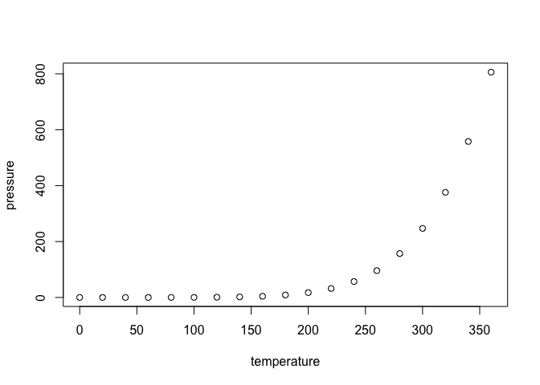

<!-- README.md is generated from README.Rmd. Please edit that file -->

# Operational ANS Performance with R

<!-- badges: start -->
<!-- badges: end -->

The goal of `{ansperf}` is to provide a enable interested stakeholders
to undertake a standardised operational performance analysis in
accordance with the ICAO Global Air Navigation Plan and/or variants used
by the international performance benchmarking community.

The package is based on the work of the Performance Section of DECEA
Brazil and the Performance Review Unit of EUROCONTROL.

This is an initial setup. Thus, the content is heavily under
development. Please come back for any updates.

## Installation

You can install the development version of the `{ansperf}` package from
[GitHub](https://github.com/) with:

``` r
# install.packages("devtools")
devtools::install_github("euctrl-pru/ansperf")
```

## Example

This is a basic example which shows you how to solve a common problem:

``` r
library(ansperf)
## basic example code
```

What is special about using `README.Rmd` instead of just `README.md`?
You can include R chunks like so:

``` r
summary(cars)
#>      speed           dist       
#>  Min.   : 4.0   Min.   :  2.00  
#>  1st Qu.:12.0   1st Qu.: 26.00  
#>  Median :15.0   Median : 36.00  
#>  Mean   :15.4   Mean   : 42.98  
#>  3rd Qu.:19.0   3rd Qu.: 56.00  
#>  Max.   :25.0   Max.   :120.00
```

You’ll still need to render `README.Rmd` regularly, to keep `README.md`
up-to-date. `devtools::build_readme()` is handy for this.

You can also embed plots, for example:



In that case, don’t forget to commit and push the resulting figure
files, so they display on GitHub and CRAN.
